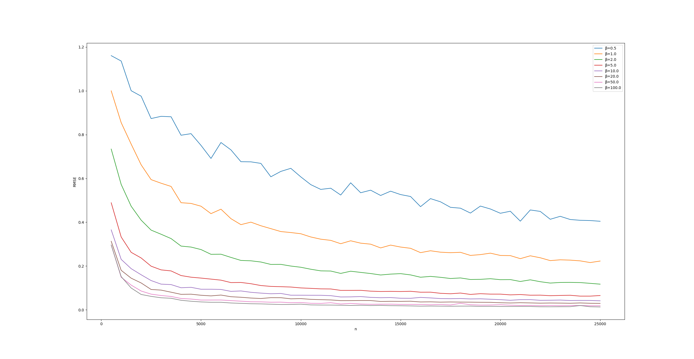
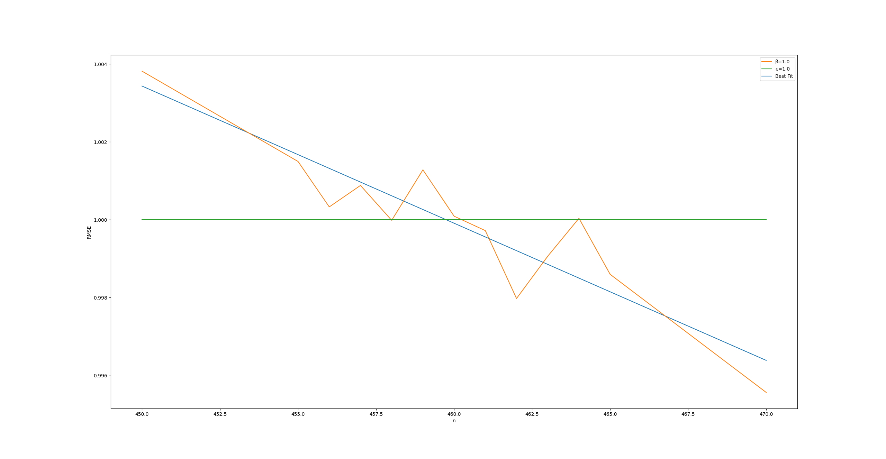

# My Regents Scholar Research Initiative Projects

I am working with Professor Arya Mazumdar to study various aspects of machine learning. Below is the documentation of my experiments and process.

# Sample Complexities of Logistic Regressions

## Motivation

On the sample complexity of estimation in logistic regression | Daniel Hsu, Arya Mazumdar

> The logistic regression model is one of the most popular data generation model in noisy binary classification problems. In this work, we study the sample complexity of estimating the parameters of the logistic regression model up to a given ℓ2 error, in terms of the dimension and the inverse temperature, with standard normal covariates. The inverse temperature controls the signal-to-noise ratio of the data generation process. While both generalization bounds and asymptotic performance of the maximum-likelihood estimator for logistic regression are well-studied, the non-asymptotic sample complexity that shows the dependence on error and the inverse temperature for parameter estimation is absent from previous analyses. We show that the sample complexity curve has two change-points (or critical points) in terms of the inverse temperature, clearly separating the low, moderate, and high temperature regimes.

[Link to the paper here.](https://arxiv.org/pdf/2307.04191.pdf)

## Mathematical Background

A summary of the above paper is presented as follows. The logistic regression model is one with continuous input $X \in \mathbb{R}$ and outputs a binary classifier $y \in \{0, 1\}$ (sometimes defined as {-1, +1} instead):

$$y = \begin{cases}
    1 & \text{ with prob. } \dfrac{1}{1+\exp(-\beta\langle X, \theta \rangle)} \\
    0 & \text{ with prob. } \dfrac{1}{1+\exp(\beta\langle X, \theta \rangle)}
\end{cases}$$

where $X = \{x_1, x_2, x_3, ..., x_n\}$, where $x_i \in \mathbb{R}^d$ and $\theta \in \mathbb{R}^d, ||\theta|| = 1.$

The value $\beta$, considered the inverse temperature, is what governs the \textit{signal-to-noise ratio}; when $\beta = 0$, we have pure noise; when $\beta = \infty$, we simply have a linear classifier which denotes where $x$ lies on the hyperplane. Then, in this project, we seek to validate the paper above's claim that the sample complexity $n^*(d, \beta, \epsilon)$, which is the smallest sample size $n$ such that $||\theta - \hat{\theta}|| < \epsilon$, satisfies

$$n^*(d, \beta, \epsilon) \asymp \begin{cases}
    \dfrac{d}{\beta^2\epsilon^2} & \text{ if } \beta ≲ 1 \text{ (high temperatures);} \\
    \dfrac{d}{\beta\epsilon^2} & \text{ if } 1 ≲ \beta ≲ \dfrac{1}{\epsilon} \text{ (medium temperatures);} \\
    \dfrac{d}{\beta^2\epsilon^2} & \text{ if } \beta ≳ \dfrac{1}{\epsilon} \text{ (low temperatures);}
\end{cases}$$

## Data Generation

To generate the dataset, I generated $\theta \sim N(0, 1)$ and $X \sim U[-1, 1]$, producing an output binary classification label $y = \text{Bern}(\sigma(X^T \cdot \theta))$ where $\sigma(\eta)$ is the sigmoid function $(1+\exp(-\eta))^{-1}$.
```python
# Dataset generation
#   Generate an array of floats from 0 to 1, and dot with theta to find z
#   Probabilities result from applying sigmoid to the z array
#   Theta is drawn from N(0,1) and normalized to a given value of beta
#   X is drawn randomly from U[-1, 1]
def generate_data(beta, n):
    np.random.seed(SEED)
    theta_gen = np.random.normal(size=(NUM_FEATURES, 1))
    theta_gen = theta_gen * beta / np.linalg.norm(theta_gen)
    X_gen = np.random.rand(n, NUM_FEATURES) * 2 - 1
    z_gen = np.dot(X_gen, theta_gen)
    y_gen = np.random.binomial(1, sigmoid(z_gen))
    return theta_gen, X_gen, y_gen
```

## Basic Scikit-Learn Model

First, I started out with a basic sci-kit model estimating a randomly generated $\theta$ when varying $n$ (sample size) and $||\theta||$ (norm of the parameter vector). I used the `LogisticRegression` class from `sklearn.linear_model` to produce various graphs with the RMSE. The sample code can be found in the folder. This model proved to not be enough as the plain setup yielded results $\hat{\theta}$ which did not approach the true norm of the parameter vector. Instead, we chose to move to [CVXPY](https://www.cvxpy.org/index.html) (convex optimization programming library).

## CVXPY

CVXPY is a library which simplifies convex optimization problems (in our case, minimizing negative logistic loss). The setup for the problem is relatively simple:
```python
# Initialize the CVXPY maximization problem.
def setup(self):
    self.weights = cp.Variable(NUM_FEATURES)
    log_likelihood = cp.sum(
        cp.multiply(np.ndarray.flatten(self.y), self.X @ self.weights) - cp.logistic(self.X @ self.weights)
    )
    constraints = [cp.norm(self.weights) <= self.beta]
    return cp.Problem(cp.Maximize(log_likelihood/self.n), constraints)
```

## Results

An initial eye estimate of critical points $n^*$ based on plotting RMSE vs $n$ averaged over 5-10 runs of each $\beta$.
| $\beta$ | $\epsilon$ | $n^*$  |
|---------|------------|--------|
| 1.0     | 1.0        | 460    |
| 2.0     | 0.5        | 1308   |
| 3.0     | 0.333      | 1759   |
| 4.0     | 0.25       | 2125   |
| 5.0     | 0.2        | 2578   |
| 6.0     | 0.166      | 2994   |
| 7.0     | 0.143      | 3404   |
| 8.0     | 0.125      | 3808   |
| 9.0     | 0.111      | 4220   |
| 10.0    | 0.1        | 4690   |
| 20.0    | 0.05       | 9350   |
| 50.0    | 0.02       | ~21000 |

I took numbers based on the graph shown here:



For $\beta = 1.0$, then, I averaged 1000 simulations per every $\Delta n=5$ centered around $n=500$, and found that it was closer to 460. Then I ran 1000 more simulations centered around $n=460$, and narrowed it down to $n^* \in [455, 465]$ and produced 3000 simulations per value of $n$ with $\Delta n = 1$, and the graph still wasn't smoothing out.



Instead, I produced a best fit line with the points $n=450, 455, 456, 457, ..., 465, 470$, assuming that the curve was approximately linear at this small scale. Thus, $n^* \approx 460$ for $\beta = 1$. I repeat this with different scales for other values of $\beta$, adjusted for computational viability (as higher values of $\beta$ produce less noisy graphs, so less iterations are needed as well.)

Observe that the data seems to fit the predictions. For plotting $n^*$ against $\beta$, we have an approximately linear relation. Since we set $\beta = \epsilon^{-1}$, we have an inverse relationship between $n^*$ and $\epsilon$, with some constant factor that comprises $d$ and other undescribed factors depicted above.

# Probit-Logit Model Mismatch

## Motivation

Finite sample rates for logistic regression with small noise or few samples | Felix Kuchelmeister, Sara van de Geer

> The logistic regression estimator is known to inflate the magnitude of its coefficients if the sample size $n$ is small, the dimension $p$ is (moderately) large or the signal-to-noise ratio $1/\sigma$ is large (probabilities of observing a label are close to 0 or 1). With this in mind, we study the logistic regression estimator with $p \ll n/\log n$, assuming Gaussian covariates and labels generated by the Gaussian link function, with a mild optimization constraint on the estimator's length to ensure existence. We provide finite sample guarantees for its direction, which serves as a classifier, and its Euclidean norm, which is an estimator for the signal-to-noise ratio.

> We distinguish between two regimes. In the low-noise/small-sample regime ($n\sigma ≲ p \log n$), we show that the estimator's direction (and consequentially the classification error) achieve the rate $(p\log n)/n$ - as if the problem was noiseless. In this case, the norm of the estimator is at least of order $n/(p \log n)$. If instead $n\sigma ≳ p \log n$, the estimator's direction achieves the rate $\sqrt{\sigma p \log n/n}$, whereas its norm converges to the true norm at the rate $\sqrt{p \log n/(n\sigma^3)}$. As a corollary, the data are not linearly separable with high probability in this regime. The logistic regression estimator allows to conclude which regime occurs with high probability. Therefore, inference for logistic regression is possible in the regime $n\sigma ≳ p \log n$. In either case, logistic regression provides a competitive classifier.

[Link to the paper here.](https://arxiv.org/abs/2305.15991)

In this paper the topic of the performance of logistic regression as a classifier in predicting outputs generated from a probit model. The probit model is defined as follows.

> Fix an unknown $\beta^* \in S^{p-1} := \{\beta \in \mathbb{R}^p : ||\beta||_2 = 1\},$ and for $i \in \{1, \dots, n\}$ define $y_i := sign(x_i^T \beta^* + \sigma \epsilon_i),$ where $\epsilon_i$ are independent standard Gaussians, and $\sigma > 0$ is a fixed, unknown parameter - the *noise-to-signal* ratio.

Notice that this model is incredibly similar to the logistic regression model, where data is generated with the sigmoid function instead of the sign function, where the sign function has a Gaussian noise which the sigmoid does not.

The paper presents the case that logistic regression is a competitive classifier for the probit model, but how, instead, does the perceptron model perform for the logistic model? This is the question I am investigating in this project.

# Hamiltonian Generative Models

A recent work used diffusion probabilistic models for image synthesis, [presented here.](https://arxiv.org/abs/2006.11239) A sibling to this model is the Hamiltonian generative model, where instead of diffusion, we model our system after Hamiltonian mechanics. 

We set up a Hamiltonian model with a UNet backbone, and train on the MNIST dataset.